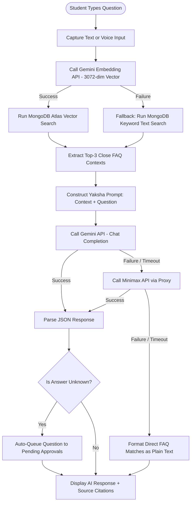

<p align="center">
  
</p>

<h1 align="center">Crowd Sourcing FAQ Project Report</h1>

---

## Index

1. [Title Page](#1-title-page)
   - Repository name, team list, repo link
2. [Executive Summary](#2-executive-summary)
3. [Introduction](#3-introduction)
4. [System Design / Architecture + Diagrams](#4-system-design--architecture--diagrams)
   - Use-Case diagram, RAG Flowchart, System Architecture Dataflow
5. [Implementation](#5-implementation)
   - 5.1 Tech stack & justification (MongoDB, Express/NestJS, React, Node)
   - 5.2 Module/feature breakdown
6. [Feature Spotlight](#6-feature-spotlight) (To be completed)
7. [Challenges & Limitations](#7-challenges--limitations) (To be completed)
8. [Future Enhancements](#8-future-enhancements) (To be completed)
9. [Conclusion](#9-conclusion) (To be completed)

---

## 1. Title Page

### Repository Information
* **Repository Name:** `vicharanashala/cs29`
* **Repository Link:** [https://github.com/vicharanashala/cs29](https://github.com/vicharanashala/cs29)
* **Program:** Vicharanashala Internship Programme (VINS), Lab for Education Design, IIT Ropar

### Team CS29 Members
| Name | Email | Role |
| :--- | :--- | :--- |
| **Rohit B Lakshmanan** (Lead) | 23f1001156@ds.study.iitm.ac.in | Full-Stack Integration, Database Architecture |
| **Adnan Zeya** | az1513@srmist.edu.in | Deployment, Docker Setup, CI/CD Pipeline |
| **Lagan Gupta** | guptalagan43@gmail.com | Frontend UI/UX Design, GSAP & 3D Hero Scene |
| **Lakshya Agarwal** | agarwallakshya561@gmail.com | Quality Assurance, Bug Fixing Taskforce |
| **Nishita Singh** | nishitasingh150@gmail.com | QA Documentation, Bug Tracking Lead |
| **Jasvinder Kaur** | kaurdetaur9718@gmail.com | API Verification, Backend QA Testing |
| **Sahil** | sahilgarg3101@gmail.com | Frontend QA Testing, UI Bug Reporting |
| **Bhavya Agarwal** | bhavyaagarwal97300@gmail.com | Database Support, Schema Discussions |
| **Deepak Thakur** | deepu14112005@gmail.com | Database Support, Schema Modeling |
| **Nandini Raj Srivastava** | nandinirajsrivastava@gmail.com | Frontend Support, UI Prototype Testing |

---

## 2. Executive Summary

During the Vicharanashala Internship Programme (VINS) at IIT Ropar, student inquiries regarding logistics, NOCs, technical setups, and project milestones naturally scale up, resulting in repetitive support queries for coordinators. The **Vicharanashala FAQ Portal** is a production-grade, full-stack crowdsourced platform designed to address this challenge. It provides students with instant, self-service information and allows the student community to collaboratively build out the database.

The portal consists of three core interfaces:
1. A **Main FAQ Dashboard** featuring keyword search, category filtering, and personal bookmarking.
2. A conversational **AI Chat Assistant (Yaksha Mini)** powered by a Retrieval-Augmented Generation (RAG) pipeline utilizing 3072-dimensional vector search on MongoDB Atlas, complete with voice input and multi-provider fallback layers.
3. An **Admin Moderation Panel** employing a maker-checker workflow where student-raised queries and peer-submitted answers are moderated before publishing to the live FAQ database, incentivized by a gamified **Spurti Points (SP)** reward system.

Through Dockerized deployment, automated CI/CD workflows, and extensive QA iteration, the platform delivers a robust solution that simplifies logistics and encourages peer-to-peer knowledge sharing.

---

## 3. Introduction

### Project Context
The Lab for Education Design at IIT Ropar manages the Vicharanashala Internship Programme (VINS). Efficiently addressing student queries at scale is a critical logistical challenge. Traditional FAQ systems are static, tedious to browse, and difficult to update dynamically, placing a heavy load on program coordinators.

### Project Objectives
* **Self-Service Information Access:** Enable students to search, view, and bookmark official program FAQs across 24 distinct categories.
* **Conversational Interface:** Provide natural-language assistance via Yaksha Mini, giving students accurate context-aware responses with matched source citations.
* **Crowdsourced FAQ Growth:** Allow students to raise unresolved queries and submit draft answers to peer questions.
* **Content Quality Control:** Enforce an admin-in-the-loop validation system (maker-checker) to verify all student contributions.
* **Gamification:** Encourage healthy community engagement by rewarding students with Spurti Points (SP) for approved questions and answers, tracked via a live Leaderboard.

---

## 4. System Design / Architecture + Diagrams

The Vicharanashala FAQ Portal uses a decoupled client-server architecture. The frontend React application manages state and routing, and coordinates with a NestJS REST API.

### 4.1 System Component Architecture
This diagram illustrates the high-level components and data integrations across the user clients, API gateway, databases, and third-party AI services.

```mermaid
graph TD
    %% User Clients
    subgraph Client Layer (Vite + React)
        Student[Student Interface]
        AdminUI[Admin Dashboard]
    end

    %% Web Application Gateway
    subgraph Application Server (NestJS Framework)
        API[REST API Gateway]
        AuthGuard[Auth Guards / Role Checkers]
        AIService[AI / RAG Service]
    end

    %% Storage & Auth Services
    subgraph Storage & Identity Layer
        DB[(MongoDB Atlas Database)]
        Firebase[Firebase Authentication]
    end

    %% Third-party AI
    subgraph External AI Services
        Gemini[Gemini API - Embeddings & Chat]
        Minimax[Minimax API via Samagama Proxy]
    end

    %% Core Data Flows
    Student -->|HTTPS Requests| API
    AdminUI -->|HTTPS Requests| API
    API --> AuthGuard
    AuthGuard -->|Verify Token| Firebase
    API -->|Mongoose Queries| DB
    AIService -->|Vector Search Aggregations| DB
    AIService -->|Generate 3072-dim Vectors| Gemini
    AIService -->|Fallback Chat Requests| Minimax
    API --> AIService
```

### 4.2 The Yaksha Mini RAG Pipeline Flowchart
This flowchart shows how student questions are processed through vector search and LLM synthesis, including fallback logic to ensure continuous operation.



### 4.3 Crowdsourced FAQ Moderation Workflow (Maker-Checker)
This diagram details the query resolution and approval workflow where students contribute questions and answers, and admins moderate them to update the FAQ catalog.

```mermaid
sequenceDiagram
    autonumber
    actor Student
    actor Peer
    actor Admin
    participant DB as MongoDB Atlas

    Student->>DB: Raise New Issue (Question)
    Note over Student, DB: System displays similar FAQ hints to prevent duplicates
    DB-->>Admin: Add to Pending Approvals (Type: QUERY)
    
    Peer->>DB: Submit Peer Answer to Open Issue
    DB-->>Admin: Add to Pending Approvals (Type: ANSWER)

    alt Admin Approves Query
        Admin->>DB: Approve Query (Status: APPROVED)
        DB->>DB: Convert to FAQ Document
        DB->>Student: Award 5 Spurti Points (SP) & Send Notification
    else Admin Approves Peer Answer
        Admin->>DB: Approve Answer (Status: APPROVED)
        DB->>DB: Merge into FAQ Database
        DB->>Peer: Award 10 Spurti Points (SP) & Send Notification
    else Admin Rejects
        Admin->>DB: Reject (Status: REJECTED)
        DB->>Student: Mark Issue Closed
    end
