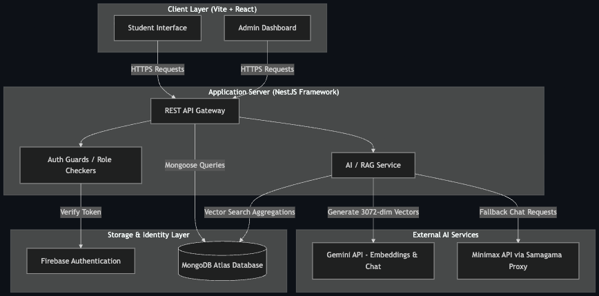
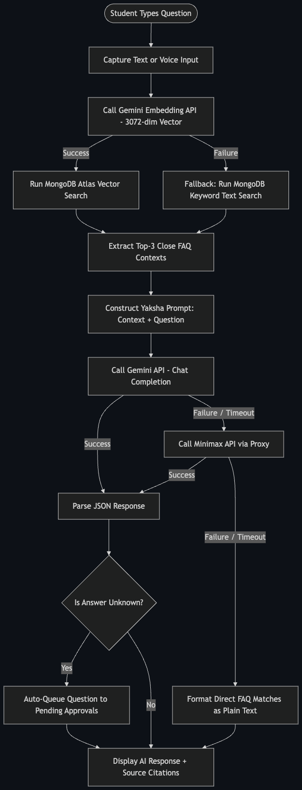
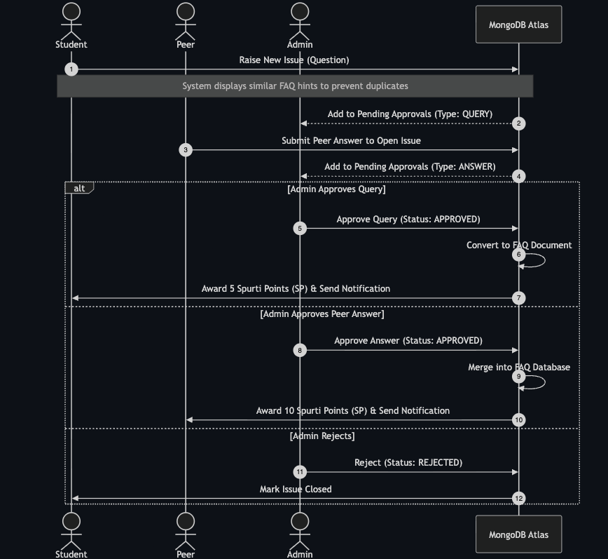

  

<h1 align="center">Crowd Sourcing FAQ Project Report</h1>

---

## Index

1. [Title Page](#1-title-page)
   - Repository name, team list, repo link
2. [Executive Summary](#2-executive-summary)
3. [Introduction](#3-introduction)
4. [System Design / Architecture + Diagrams](#4-system-design--architecture--diagrams)
   - Use-Case diagram, RAG Flowchart, System Architecture Dataflow
5. [Implementation](#5-implementation)
   - 5.1 Tech stack & justification (MongoDB, Express/NestJS, React, Node)
   - 5.2 Module/feature breakdown
6. [Feature Spotlight](#6-feature-spotlight)
7. [Challenges & Limitations](#7-challenges--limitations)
8. [Future Enhancements](#8-future-enhancements)
9. [Conclusion](#9-conclusion)

---

## 1. Title Page

### Repository Information
* **Repository Name:** `vicharanashala/cs29`
* **Repository Link:** [https://github.com/vicharanashala/cs29](https://github.com/vicharanashala/cs29)
* **Program:** Vicharanashala Internship Programme (VINS), Lab for Education Design, IIT Ropar

### Team CS29 Members
| Name | Email | Role |
| :--- | :--- | :--- |
| **Rohit B Lakshmanan** (Lead) | 23f1001156@ds.study.iitm.ac.in | Full-Stack Integration, Database Architecture |
| **Adnan Zeya** | az1513@srmist.edu.in | Deployment, Docker Setup, CI/CD Pipeline |
| **Lagan Gupta** | guptalagan43@gmail.com | Frontend UI/UX Design, GSAP & 3D Hero Scene |
| **Lakshya Agarwal** | agarwallakshya561@gmail.com | Quality Assurance, Bug Fixing Taskforce |
| **Nishita Singh** | nishitasingh150@gmail.com | QA Documentation, Bug Tracking Lead |
| **Jasvinder Kaur** | kaurdetaur9718@gmail.com | API Verification, Backend QA Testing |
| **Sahil** | sahilgarg3101@gmail.com | Frontend QA Testing, UI Bug Reporting |
| **Bhavya Agarwal** | bhavyaagarwal97300@gmail.com | Database Support, Schema Discussions |
| **Deepak Thakur** | deepu14112005@gmail.com | Database Support, Schema Modeling |
| **Nandini Raj Srivastava** | nandinirajsrivastava@gmail.com | Frontend Support, UI Prototype Testing |

---

## 2. Executive Summary

During the Vicharanashala Internship Programme (VINS) at IIT Ropar, student inquiries regarding logistics, NOCs, technical setups, and project milestones naturally scale up, resulting in repetitive support queries for coordinators. The **Vicharanashala FAQ Portal** is a production-grade, full-stack crowdsourced platform designed to address this challenge. It provides students with instant, self-service information and allows the student community to collaboratively build out the database.

The portal consists of three core interfaces:
1. A **Main FAQ Dashboard** featuring keyword search, category filtering, and personal bookmarking.
2. A conversational **AI Chat Assistant (Yaksha Mini)** powered by a Retrieval-Augmented Generation (RAG) pipeline utilizing 3072-dimensional vector search on MongoDB Atlas, complete with voice input and multi-provider fallback layers.
3. An **Admin Moderation Panel** employing a maker-checker workflow where student-raised queries and peer-submitted answers are moderated before publishing to the live FAQ database, incentivized by a gamified **Spurti Points (SP)** reward system.

Through Dockerized deployment, automated CI/CD workflows, and extensive QA iteration, the platform delivers a robust solution that simplifies logistics and encourages peer-to-peer knowledge sharing.

---

## 3. Introduction

### Project Context
The Lab for Education Design at IIT Ropar manages the Vicharanashala Internship Programme (VINS). Efficiently addressing student queries at scale is a critical logistical challenge. Traditional FAQ systems are static, tedious to browse, and difficult to update dynamically, placing a heavy load on program coordinators.

### Project Objectives
* **Self-Service Information Access:** Enable students to search, view, and bookmark official program FAQs across 24 distinct categories.
* **Conversational Interface:** Provide natural-language assistance via Yaksha Mini, giving students accurate context-aware responses with matched source citations.
* **Crowdsourced FAQ Growth:** Allow students to raise unresolved queries and submit draft answers to peer questions.
* **Content Quality Control:** Enforce an admin-in-the-loop validation system (maker-checker) to verify all student contributions.
* **Gamification:** Encourage healthy community engagement by rewarding students with Spurti Points (SP) for approved questions and answers, tracked via a live Leaderboard.

---

## 4. System Design / Architecture + Diagrams

The Vicharanashala FAQ Portal uses a decoupled client-server architecture. The frontend React application manages state and routing, and coordinates with a NestJS REST API.

### 4.1 System Component Architecture
This diagram illustrates the high-level components and data integrations across the user clients, API gateway, databases, and third-party AI services.

  

### 4.2 The Yaksha Mini RAG Pipeline Flowchart
This flowchart shows how student questions are processed through vector search and LLM synthesis, including fallback logic to ensure continuous operation.

  

### 4.3 Crowdsourced FAQ Moderation Workflow (Maker-Checker)
This diagram details the query resolution and approval workflow where students contribute questions and answers, and admins moderate them to update the FAQ catalog.

  

---

## 5. Implementation

### 5.1 Tech Stack & Justification

The Vicharanashala FAQ Portal is built on a MongoDB, NestJS (Node.js/Express), React, and TypeScript architecture. The rationale for selecting this specific stack is detailed below:

* **MongoDB (via Mongoose):**
  * *Flexible Schema:* FAQs naturally expand and adapt over time. For instance, storing optional fields like Hindi translations (`answer_hi`) and bookmarks as array references is trivial with MongoDB’s document model compared to traditional relational models.
  * *Integrated Vector Search:* MongoDB Atlas features native Vector Search capabilities. This allowed us to run our Retrieval-Augmented Generation (RAG) pipeline directly on the database cluster using cosine similarity, avoiding the complexity and overhead of managing an external vector database (such as Pinecone or Milvus).
* **NestJS & Express (Node.js Runtime):**
  * *Architectural Consistency:* NestJS provides an out-of-the-box modular architecture. It separates concerns into Controllers, Services, and Modules. This makes the codebase maintainable, particularly when separating complex logic like the `AiService` from route controllers.
  * *High Performance:* Under the hood, NestJS runs on Express, offering a lightweight, asynchronous execution model that handles highly concurrent REST API requests with low latency.
* **React 19, Vite & TypeScript:**
  * *Reactive UI & Performance:* Vite builds the application in seconds, while React 19 ensures fast virtual DOM rendering. TypeScript provides end-to-end type safety between backend API responses and frontend props.
  * *State Synchronization:* Using TanStack Query, the application synchronizes server state (such as the global leaderboard, notifications, and admin stats) with client-side views. This reduces manual refetch boilerplate and handles automatic background polling.
* **Firebase Authentication:**
  * *Secure Credentials:* Handles user authentication securely, including email verification and Google OAuth, shielding the database from storing raw user passwords and reducing the compliance scope.

### 5.2 Module/Feature Breakdown

The codebase is logically split into four operational modules:
1. **FAQ Management Module:** Handles database CRUD for official FAQs. Tracks individual view counts to power the "Most Asked FAQs" dashboard section.
2. **AI Engine (RAG Pipeline):** Responsible for converting user questions into 3072-dimensional vector embeddings via the Gemini API, querying MongoDB Atlas Vector Search, constructing the persona-based system prompt, and calling Gemini (or Minimax fallback) to return synthesised, citation-linked responses.
3. **Crowdsourced Moderation Workflow:** Tracks student-raised queries and peer-submitted answers in the `pending_approvals` collection. Implements a messaging thread on each issue where admins and students can converse.
4. **Gamification & Notifications Module:** Manages user Spurti Points (SP) balances, builds the leaderboard, and distributes real-time notifications to users when their contributions are approved or when system announcements are broadcasted.

---

## 6. Feature Spotlight

### 6.1 Self-Healing RAG Pipeline (Yaksha Mini)
* **Purpose:** Provides students with immediate, natural-language answers derived exclusively from official program materials, reducing the coordinator support burden.
* **Technical Innovation:** Rather than failing when an external API is down or rate-limited, the AI pipeline is designed to be fully self-healing:
  * If the Gemini embedding API fails, it automatically reverts to standard text/regex keyword matching.
  * If the primary LLM (Gemini) fails or times out, it performs 3 retries with exponential back-off before automatically routing to the Minimax fallback endpoint via the Samagama proxy.
  * If both providers fail, the system falls back to returning the raw list of matching FAQ cards.
* **Accessibility:** Integrates the Web Speech API (`SpeechRecognition`) directly into the floating widget, allowing students to ask questions via voice input.

### 6.2 Maker-Checker Crowdsourced FAQ Workflow
* **Purpose:** Enables the FAQ database to grow organically through student contributions while maintaining absolute factual accuracy.
* **Workflow:**
  * Unresolved questions raised by students are checked for duplicates via debounced semantic similarity alerts, then queued as pending queries.
  * Peers can draft answers. Both queries and peer-submitted answers reside in a protected moderation queue.
  * An Admin reviews the draft. Upon approval, the question-answer pair is automatically formatted, injected into the main FAQ collection, and published. The contributor is notified and rewarded.

### 6.3 Gamification Loop
* **Purpose:** Incentivizes high-quality community participation.
* **Implementation:** Students earn Spurti Points (SP) for their contributions—5 SP for an approved query that becomes a FAQ, and 10 SP for an approved peer answer. The backend enforces database-level idempotency checks (via the `spAwarded` flag on approvals) to prevent duplicate SP payouts.

### 6.4 Demonstration Video
* **Video Link:** [CSFAQ Project Recording - Google Drive](https://drive.google.com/file/d/1Wwtbe3GiKH2NgOP4HgboC2i_HLLpM_Pm/view?usp=sharing)
* **Access Level:** Configured with "Anyone with the link can view" access.
* **Duration:** Strictly 60 seconds. Demonstrates:
  * Typing a question in the Yaksha Mini chat widget and receiving an AI response with citations.
  * Raising an issue with debounced similar FAQ suggestions.
  * Admin moderation queue reviewing and approving a peer answer.
  * Spurti Points updating live on the Leaderboard.

---

## 7. Challenges & Limitations

### 7.1 API Key & Credit Exhaustion
* **Challenge:** During intensive testing, our primary Gemini API limits were hit, resulting in `429 Rate Limit` and `503 Service Unavailable` exceptions.
* **Resolution:** The multi-provider fallback architecture caught these errors and seamlessly switched to the Minimax API. The transition was completely transparent to the user, validating our design decision.

### 7.2 Partial Third-Party Integrations (Firebase & OTP)
* **Challenge:** Integrating Firebase Google Sign-In and local SMS OTP was completed on the frontend but not fully wired with backend guard checks.
* **Limitation:** In the current prototype, the backend uses a development bypass for Firebase authentication. The OTP verification step accepts the mock code `123456`. Removing these bypass mechanisms is required before moving to staging.

### 7.3 Frontend Session Security
* **Challenge:** The frontend stores JWT auth tokens in `localStorage` for convenience.
* **Limitation:** While functional for a prototype, `localStorage` is vulnerable to Cross-Site Scripting (XSS). In production, this must be migrated to HTTP-only, secure, SameSite cookies.

---

## 8. Future Enhancements

* **Automated FAQ Translation:** Integrate translation services (via Gemini or Cloud Translation API) to automatically translate newly approved FAQs into Hindi, populating the `answer_hi` database field instantly.
* **Visual Profile Badges:** Introduce visual profile achievements (e.g. "Top Solver", "Logistics Guru") based on Spurti Point tiers to further drive engagement.
* **Push Notifications & Email Alerts:** Expand notifications from in-app drawers to push notifications and direct emails using Nodemailer or SendGrid when an admin responds to an issue thread.
* **Advanced Vector Chunking:** Support document upload (PDFs, DOCX) in the admin panel, automatically splitting documents into overlapping chunks and re-generating embeddings for broader domain-knowledge indexing.

---

## 9. Conclusion

The Vicharanashala FAQ Portal successfully transforms a static information list into an interactive, crowdsourced, AI-assisted platform. By combining a robust NestJS backend with a reactive React frontend and a self-healing RAG pipeline, the system resolves student questions immediately while allowing program coordinators to easily moderate and scale the FAQ base. 

Developed by Team CS29 for the VINS program at IIT Ropar, the project provides a practical demonstration of modern web engineering principles, demonstrating the utility of vector databases, multi-provider AI integrations, and gamified workflows in educational design.
